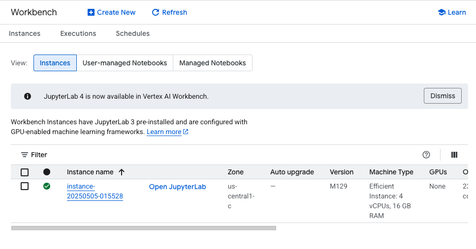
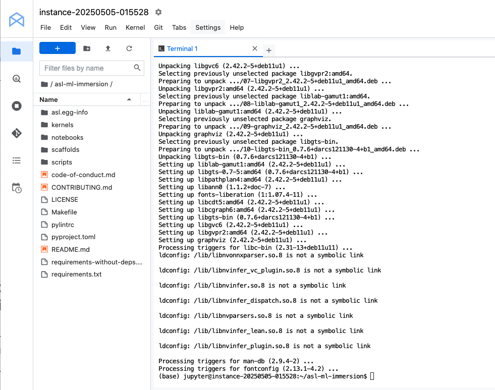
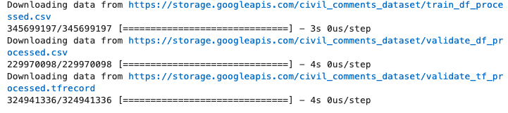
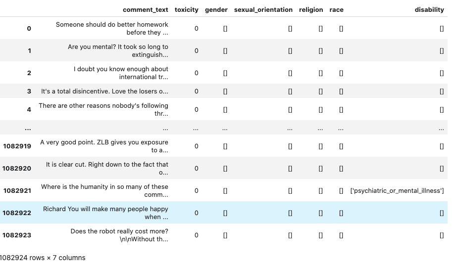
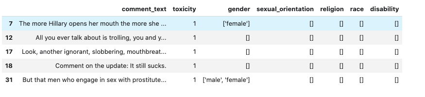
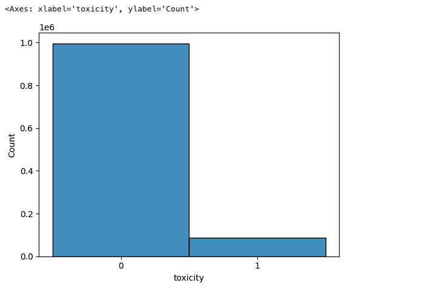
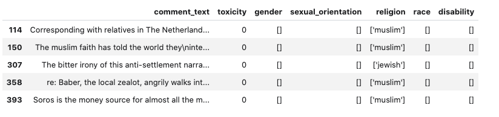
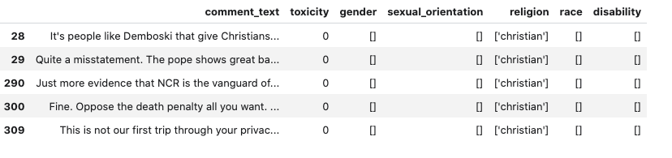
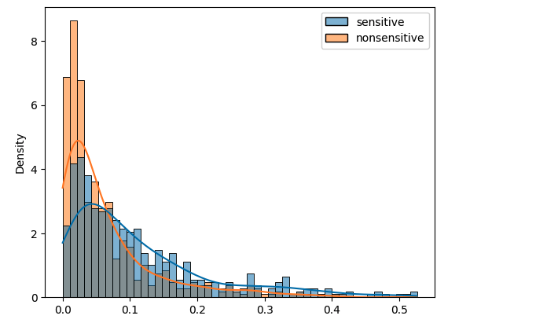
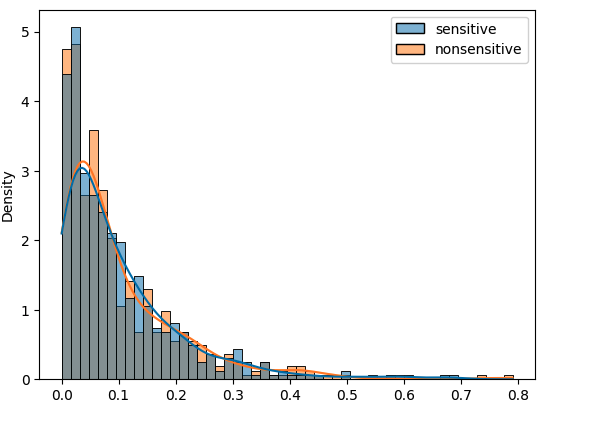

# GCP-LAB-Mitigate-Bias-with-MinDiff-in-TensorFlow
Mitigate Bias with MinDiff in TensorFlow

#### Overview
This lab helps you learn how to mitigate bias using MinDiff technique by leveraging TensorFlow Model Remediation library.

#### Learning objectives
1. Explore the toxicity text dataset.
2. Build and train a toxicity classification model.
3. Check the model bias by plotting the prediction results.
4. Apply MinDiff technique using TensorFlow Model Remediation library.
5. Compare the result between the baseline and MinDiff models.


#### Enable the Notebooks API
1. In the Google Cloud Console, on the Navigation menu, click APIs & Services > Library.

2. Search for Notebooks API and press ENTER.

3. Click on the Notebooks API result, and if the API is not enabled, click Enable.


#### Enable the Vertex AI API
1. In the Google Cloud Console, on the Navigation menu, click Vertex AI > Dashboard.

2. Click ENABLE ALL RECOMMENDED APIS.

### Task 1. Open Vertex AI Workbench instance

1. In the Google Cloud Console, on the Navigation Menu, click Vertex AI > Workbench.

2. On the Instance page, click CREATE NEW.

3. Please use the default zone and region: zone placeholder region placeholder. Leave the remaining settings as they are and then click Create. The new VM will take 2-3 minutes to start.

4. Click Open JupyterLab. A JupyterLab window will open in a new tab.




### Task 2. Clone a course repo within your Vertex AI Workbench instance

To clone the notebook in your JupyterLab instance:

1. In JupyterLab, open a new terminal window.

2. At the command-line prompt, run the following command:

```
git clone https://github.com/GoogleCloudPlatform/asl-ml-immersion.git
cd asl-ml-immersion
export PATH=$PATH:~/.local/bin
make install
```



3. To confirm that you have cloned the repository, double-click on the asl-ml-immersion directory and ensure that you can see its contents. The files for all the Jupyter notebook-based labs throughout this course are available in this directory.

### Task 3. Use TensorFlow Model Remediation to Mitigate Bias

1. In the notebook interface, navigate to asl-ml-immersion > notebooks > responsible_ai > fairness > solutions and open min_diff_keras.ipynb.

2. In the notebook interface, click Edit > Clear All Outputs.

3. Carefully read through the notebook instructions and run through the notebook.

>Tip: To run the current cell, click the cell and press SHIFT+ENTER. Other cell commands are listed in the notebook UI under Run.

#### Import all necessary components, including MinDiff in TensorFlow Model Remediation library.

```
import os
import warnings

os.environ["TF_CPP_MIN_LOG_LEVEL"] = "2"
warnings.filterwarnings("ignore")
```

```
import copy

import numpy as np
import seaborn as sns
import tensorflow as tf
import tensorflow_hub as hub
import tensorflow_model_remediation.min_diff as md
from tensorflow_model_remediation.tools.tutorials_utils import (
    min_diff_keras_utils,
)
```

#### Prepare Dataset

We use a utility function to download the preprocessed data and prepare the labels to match the model’s output shape. The function also downloads the data as TFRecords to make later evaluation quicker. Alternatively, you may convert the Pandas DataFrame into TFRecords with any available utility conversion function.

```
(
    data_train,
    data_validate,
    _,
    _,
    _,
) = min_diff_keras_utils.download_and_process_civil_comments_data()

```



Let's take a look at the dataset.

`data_train`



`data_train[data_train["toxicity"] == 1].head()`



`sns.histplot(data_train.toxicity.apply(str))`



It looks like the positive (toxic) data is much fewer than the negative (non-toxic) data.

We define a few constants. Note that the batch size here is chosen arbitrarily, but in a production setting you would need to tune it for best performance.


```
TEXT_FEATURE = "comment_text"
LABEL = "toxicity"
BATCH_SIZE = 512
```

We convert the training data from pandas dataframe to tf.data, and create a generator that yields a batch.

We also convert our Pandas DataFrames into Tensorflow Datasets. Note that unlike the Keras model API for Pandas DataFrames, using Datasets means that we need to provide the model’s input features and labels together in one Dataset. Here we provide the 'comment_text' as an input feature and reshape the label to match the model's expected output.

We batch the Dataset at this stage, too.

```
def make_dataset(df, batch_size):
    dataset = tf.data.Dataset.from_tensor_slices(
        (
            df[TEXT_FEATURE].values,
            df[LABEL].values,
        )
    ).batch(batch_size)
    return dataset


dataset_train_main = make_dataset(data_train, BATCH_SIZE)
dataset_valid_main = make_dataset(data_validate, BATCH_SIZE)
```

#### Define and train the baseline model
Let's define a simple baseline model to classify the text toxicity. It is a simple Keras sequential model with an initial embedding and dense layers, outputting a toxicity prediction.


```
def build_model():
    hub_url = "https://tfhub.dev/google/tf2-preview/nnlm-en-dim128/1"

    model = tf.keras.Sequential()

    # Embedding layer.
    hub_layer = hub.KerasLayer(
        hub_url, output_shape=[128], input_shape=[], dtype=tf.string
    )
    model.add(hub_layer)
    model.add(tf.keras.layers.Dense(32, activation="relu"))
    model.add(tf.keras.layers.Dense(1, activation="sigmoid"))
    return model


baseline_model = build_model()
```

```
optimizer = tf.keras.optimizers.Adam(learning_rate=0.001)
loss = tf.keras.losses.BinaryCrossentropy()
baseline_model.compile(optimizer=optimizer, loss=loss, metrics=["accuracy"])

history = baseline_model.fit(
    x=dataset_train_main, batch_size=BATCH_SIZE, epochs=1
)
```

>2116/2116 [==============================] - 24s 11ms/step - loss: 0.2501 - accuracy: 0.9190

```
valid_result = baseline_model.evaluate(dataset_valid_main)
print(f"Validation Accuracy: {valid_result[1]}")
```
 >1411/1411 [==============================] - 15s 10ms/step - loss: 0.2318 - accuracy: 0.9216
Validation Accuracy: 0.92158043384552


#### Prepare data splits for MinDiff
To use MinDiff, we create two additional data splits:

A split for non-toxic examples referencing minority groups: In our case, this will include comments with references to our underperforming identity terms. We don’t include some of the groups because there are too few examples, leading to higher uncertainty with wide confidence interval ranges.
A split for non-toxic examples referencing the majority group.
It’s important to have sufficient examples belonging to the underperforming classes. Based on your model architecture, data distribution, and MinDiff configuration, the amount of data needed can vary significantly. In past applications, we have seen MinDiff work well with 5,000 examples in each data split.

In our case, the groups in the minority splits have example quantities of 9,688 and 3,906. Note the class imbalances in the dataset; in practice, this could be cause for concern, but we won’t seek to address them in this notebook since our intention is just to demonstrate MinDiff.

We select only negative examples for these groups, so that MinDiff can optimize on getting these examples right. It may seem counterintuitive to carve out sets of ground truth negative examples if we’re primarily concerned with disparities in false positive rate (FPR), but remember that a false positive prediction is a ground truth negative example that’s incorrectly classified as positive, which is the issue we’re trying to address.


#### Create splits with DataFrame
First, let's create the splits using pandas DataFrame.

Note how we define majority and minority in this dataset. And we filter out positive example.


```
def create_mindiff_datasets(df):
    # Create masks for the sensitive and nonsensitive groups
    minority_mask = df.religion.apply(
        lambda x: any(religion in x for religion in ("jewish", "muslim", "buddist", "hindu"))
    )
    majority_mask = df.religion.apply(lambda x: x == "['christian']")

    # Select nontoxic examples, so MinDiff will be able to reduce sensitive FP rate.
    true_negative_mask = df["toxicity"] == 0

    data_sensitive = df[minority_mask & true_negative_mask]
    data_nonsensitive = df[majority_mask & true_negative_mask]
    return data_sensitive, data_nonsensitive


data_train_sensitive, data_train_nonsensitive = create_mindiff_datasets(
    data_train
)
data_valid_sensitive, data_valid_nonsensitive = create_mindiff_datasets(
    data_validate
)
```

Now we got two DataFrames for majority and minority.


`data_train_sensitive.head()`




`data_train_nonsensitive.head()`



#### Create MinDiff Datasets
Then, we wrap them in tf.data.Dataset using the make_dataset function defined above.

Note that we tune the batch size selection the same way it is tuned for the baseline model, taking into account training speed and hardware considerations while balancing with model performance. Here we have chosen the same batch size for all three datasets but this is not a requirement, although it’s good practice to have the two MinDiff batch sizes be equivalent.

```
dataset_train_sensitive = make_dataset(data_train_sensitive, BATCH_SIZE)
dataset_train_nonsensitive = make_dataset(data_train_nonsensitive, BATCH_SIZE)
dataset_valid_sensitive = make_dataset(data_valid_sensitive, BATCH_SIZE)
dataset_valid_nonsensitive = make_dataset(data_valid_nonsensitive, BATCH_SIZE)
```

#### Baseline Model Evaluation
##### Check the Prediction distribution
Now we have two data splits.

Let's take a look at the prediction distribution for majority (nonsensitive) and minority (sensitive) classes using the baseline model.
Please remember that we only use negative examples, so ideally the predictions should be closer to 0.0.

```
def visualize_pred_histogram(model):
    for (f, l), (non_f, non_l) in zip(
        dataset_valid_sensitive.take(1), dataset_valid_nonsensitive.take(1)
    ):
        res = tf.squeeze(model(f))
        non_res = tf.squeeze(model(non_f))
        sns.histplot(
            {"sensitive": res, "nonsensitive": non_res},
            bins=50,
            kde=True,
            stat="density",
        )


visualize_pred_histogram(baseline_model)
```



We can see a distribution difference between splits, and the minority dataset has lower confidence for the negative cases, that will lead to higher false positives.

#### Check FPR

```
def false_positive_rate(y_true, y_pred, thresholds):
    fp = tf.keras.metrics.FalsePositives(thresholds=thresholds)
    fp.update_state(y_true, y_pred)
    fp = fp.result().numpy()

    tn = tf.keras.metrics.TrueNegatives(thresholds=thresholds)
    tn.update_state(y_true, y_pred)
    tn = tn.result().numpy()
    return fp / (fp + tn)
```

```
def compute_fpr(model, thresholds=0.5):
    nonsensitive_prediction = model.predict(
        data_train_nonsensitive[TEXT_FEATURE], batch_size=BATCH_SIZE, verbose=3
    )
    sensitive_prediction = model.predict(
        data_train_sensitive[TEXT_FEATURE], batch_size=BATCH_SIZE, verbose=3
    )

    nonsensitive_fpr = false_positive_rate(
        data_train_nonsensitive[LABEL].values,
        nonsensitive_prediction,
        thresholds=thresholds,
    )
    sensitive_fpr = false_positive_rate(
        data_train_sensitive[LABEL].values,
        sensitive_prediction,
        thresholds=thresholds,
    )

    print(f"Nonsensitive FPR: {nonsensitive_fpr:>5.5f}")
    print(f"Sensitive FPR: {sensitive_fpr:>10.5f}")
```

`compute_fpr(baseline_model, thresholds=0.2)`


>Nonsensitive FPR: 0.06366
Sensitive FPR:    0.15581

We can see the baseline model is performing differently on different splits.


#### Define and Train the MinDiff Model
Now, we’ll try to improve the FPR for underperforming religious groups. We’ll attempt to do so using MinDiff, a remediation technique that seeks to balance error rates across slices of your data by penalizing disparities in performance during training. When we apply MinDiff, model performance may degrade slightly on other slices. As such, our goals with MinDiff will be:

- Improved performance for underperforming groups
- Limited degradation for other groups and overall performance

To train with MinDiff, we have to follow these steps:

Define the model architecture
Wrap it in a MinDiffModel with a corresponding loss and loss_weight.
Compile the model normally (using the regular non-MinDiff loss) and fit to train.
For the loss definition, we use 1.5 as the default loss_weight, which means how we prioritize the MinDiff loss over the primary cross entropy loss, but this is a parameter that needs to be tuned for your use case, since it depends on your model and product requirements.
You can experiment with changing the value to see how it impacts the model, noting that increasing it pushes the performance of the minority and majority groups closer together but may come with more pronounced tradeoffs.

```
original_model = build_model()

min_diff_loss = md.losses.MMDLoss()
min_diff_weight = 1.5

min_diff_model = md.keras.MinDiffModel(
    original_model, min_diff_loss, min_diff_weight
)

optimizer = tf.keras.optimizers.Adam(learning_rate=0.001)
loss = tf.keras.losses.BinaryCrossentropy()
min_diff_model.compile(optimizer=optimizer, loss=loss, metrics=["accuracy"])
```

And we also defines the dataset that will be passed to the MinDiffModel during training.

Here we repeat the dataset so that we can train on the same amount as the base model for comparison.

```
min_diff_dataset = md.keras.utils.input_utils.pack_min_diff_data(
    original_dataset=dataset_train_main,
    sensitive_group_dataset=dataset_train_sensitive,
    nonsensitive_group_dataset=dataset_train_nonsensitive,
)

min_diff_dataset = min_diff_dataset.repeat(
    int(
        dataset_train_main.cardinality()
        // dataset_train_sensitive.cardinality()
    )
)
```

Now let's execute the MinDiff training.


`history = min_diff_model.fit(min_diff_dataset, epochs=1)`

>2106/2106 [==============================] - 89s 41ms/step - loss: 0.2384 - accuracy: 0.9221 - min_diff_loss: 0.0012

Next we evaluate the results.

#### MinDiff Model Evaluation

Let's take a look at the result by visualizing the prediction distribution again.

`visualize_pred_histogram(min_diff_model)`



This looks much better sicce the distributions are closer compared to the baseline model.

Let's check the FPR as we did for the baseline model.

`compute_fpr(min_diff_model, thresholds=0.2)`

>Nonsensitive FPR: 0.14010
Sensitive FPR:    0.14422

FPRs for sensitive and nonsensitive datasets are also very close!

In a production setting, we have to pick a threshold to ensure that the model behavior meets launch standards.
This threshold may be different from the one you selected for the baseline model. Try selecting false positive rate with threshold 0.300.

`compute_fpr(min_diff_model, thresholds=0.3)`

>Nonsensitive FPR: 0.05929
Sensitive FPR:    0.06122

